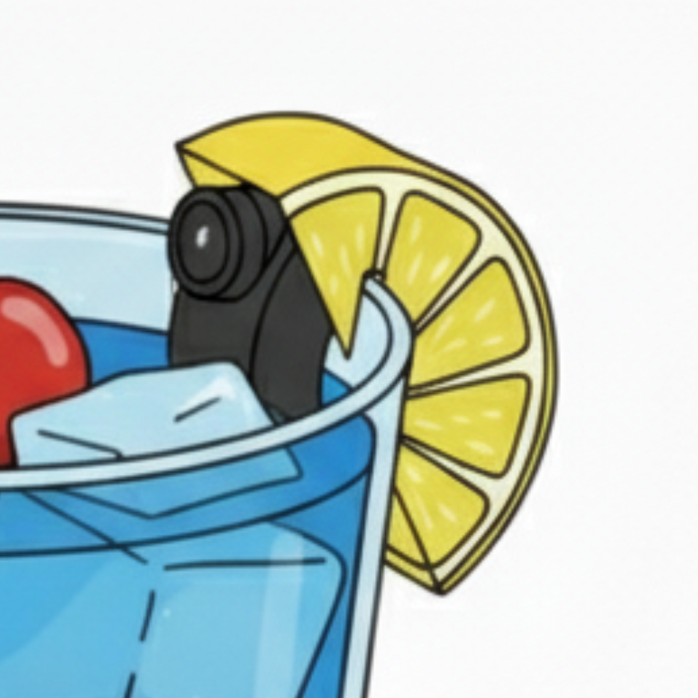

<p align="center">
  
</p>
<h1 align="center">SipBuddy</h1>

<p align="center">
  <strong>Your drink's best friend.</strong><br/>
  A drink-safety iOS companion that pairs with custom BLE hardware to detect tampering in real time, capture evidence, and alert your trusted contacts — so you can sip with confidence.
</p>

<p align="center">
  
  
  
  
  
  
</p>

---

## Table of Contents

- [Overview](#overview)
- [Features](#features)
- [Architecture](#architecture)
- [Tech Stack](#tech-stack)
- [Hardware Integration](#hardware-integration)
- [Getting Started](#getting-started)
- [Configuration](#configuration)
- [Project Structure](#project-structure)
- [CI / CD](#ci--cd)
- [Testing](#testing)
- [Release Notes](#release-notes)
- [Contributing](#contributing)
- [License](#license)

---

## Overview

**SipBuddy** is a capstone iOS application designed to combat drink tampering (e.g., drink spiking) in social settings. It pairs over Bluetooth Low Energy (BLE) with a custom hardware sensor device that monitors a drink using a camera. When the device detects potential tampering it streams JPEG frames to the iPhone, where the app creates a full incident record — complete with location, timestamps, animated playback, and cloud backup — and can instantly notify your emergency contacts.

### Why SipBuddy?

Drink spiking affects **1 in 13 college students** in the US. SipBuddy puts proactive detection directly in your pocket with real-time alerts, evidence capture, and a buddy system that keeps your circle informed.

---

## Features

### Drink Monitoring & Incident Detection
- **Real-time BLE streaming** — JPEG frames flow from the hardware device to your phone via Nordic UART Service
- **Progressive incident capture** — Frames are assembled, sequenced, and stored with full metadata (location, timestamp, place name)
- **Animated playback** — Instagram Reels-style viewer with frame-by-frame scrubbing and auto-generated animated GIFs
- **Persistent storage** — Incidents survive app restarts via on-device Property List persistence
- **Cloud backup** — Incident media (GIF/PNG) uploaded to Azure Blob Storage for safe keeping

### Buddy System
- **Emergency contacts** — Add trusted contacts directly from your iOS address book
- **Two alert modes** — _Auto-send_ via server webhook (Twilio SMS) or _Ask-first_ with a pre-filled iMessage composer including the incident GIF
- **One-tap safety net** — When an incident fires, your buddies know within seconds

### SipMap
- **Proximity radar** — MapKit-based view showing nearby SipBuddy devices with concentric distance rings (immediate < 1.5 m, near 1.5–5 m, far 5 m+)
- **Burst BLE scanning** — Rapid device discovery with RSSI-based distance estimation
- **Reverse geocoding** — Incidents tagged with friendly place names (bar, park, venue)

### Smart Notifications
- **Time-sensitive alerts** — Local push notifications with image thumbnails for incidents, battery warnings, and unexpected disconnects
- **Haptic feedback** — Tactile alerts for critical events
- **Dynamic Island / Live Activity** — ActivityKit integration showing current device mode (Detect / Sleep) at a glance

### On-Device ML _(Infrastructure Ready)_
- **CoreML + Vision + Metal** pipeline scaffolded for incident-frame classification
- Designed for future models to distinguish between benign interactions and tampering

### Authentication & Privacy
- **Firebase Auth** — Email/password sign-up, sign-in, and password reset
- **Account deletion** — GDPR-compliant self-serve account removal with reauthentication
- **Secrets management** — API keys loaded from a git-ignored `Secrets.plist`

### Analytics & Telemetry
- **PostHog** — Product analytics with session replay (screenshot mode for SwiftUI), event capture, and user segmentation
- **Azure Telemetry** — Heartbeat, connection lifecycle, mode changes, and incident events streamed to a backend API
- **Firebase bridge** — Auth state synced to PostHog for unified identity tracking

---

## Architecture

SipBuddy follows an **MVVM** pattern powered by SwiftUI's reactive `@EnvironmentObject` injection.

```
┌─────────────────────────────────────────────────────────┐
│                      SwiftUI Views                      │
│  HomeView · SipMapView · IncidentsView · BuddySystem…   │
└──────────────┬──────────────────────────┬───────────────┘
               │ @EnvironmentObject       │
┌──────────────▼──────────────┐ ┌────────▼────────────────┐
│       ObservableObjects     │ │      Singletons          │
│  AppState · IncidentStore   │ │  BLEManager.shared       │
│  BuddyStore · AuthManager   │ │  MLInferenceManager      │
│  UserIdentityStore          │ │  NotificationManager     │
│  TelemetryManager           │ │  PostHogService          │
│  LocationManager            │ │  ThreadingManager        │
└─────────────────────────────┘ └──────────────────────────┘
               │                          │
┌──────────────▼──────────────────────────▼───────────────┐
│                   Service Layer                         │
│  BLE Protocol Parser (SigFinder → BUF → FR2 Assembler) │
│  GIF Encoder · Secrets Manager · Performance Logger     │
│  Firebase Telemetry Bridge · Mode Activity Manager      │
└─────────────────────────────────────────────────────────┘
               │
┌──────────────▼──────────────────────────────────────────┐
│                 Hardware / Platform                      │
│  CoreBluetooth · CoreLocation · CoreML · ActivityKit    │
│  UserNotifications · MessageUI · ContactsUI             │
└─────────────────────────────────────────────────────────┘
```

### Key Design Decisions

| Pattern | Rationale |
|---------|-----------|
| **Centralized threading** | `ThreadingManager` provides 6 dedicated dispatch queues (image processing, disk I/O, ML inference, notification prep, network, BLE parsing) with appropriate QoS levels |
| **Coalesced disk writes** | 300 ms debounce on incident saves prevents disk thrashing during rapid frame streams |
| **BLE state restoration** | `CBCentralManagerOptionRestoreIdentifierKey` enables auto-reconnect even after the app is terminated by the system |
| **Streaming protocol parser** | `SigFinder` → `BUFHeaderParser` → `FR2Assembler` pipeline reliably reassembles binary frame data from chunked BLE packets |

---

## Tech Stack

| Category | Technologies |
|----------|-------------|
| **Language** | Swift 5.9 |
| **UI** | SwiftUI, UIKit (haptics, contacts), MapKit, ActivityKit |
| **Bluetooth** | CoreBluetooth (Nordic UART Service — 6 characteristics) |
| **Auth** | Firebase Auth (email/password) |
| **Analytics** | PostHog iOS SDK (session replay, event capture, user properties) |
| **ML** | CoreML, Vision, Metal |
| **Location** | CoreLocation (reverse geocoding, precise location) |
| **Notifications** | UserNotifications (time-sensitive, image attachments) |
| **Cloud** | Azure Blob Storage (SAS uploads), Azure App Service (telemetry API) |
| **Messaging** | MessageUI, Twilio (via webhook) |
| **Media** | ImageIO / UniformTypeIdentifiers (animated GIF encoding) |
| **CI/CD** | GitHub Actions (macOS 15, Xcode, xcpretty) |

### Swift Package Dependencies

| Package | Version |
|---------|---------|
| firebase-ios-sdk | 12.10.0 |
| posthog-ios | 3.42.1 |

---

## Hardware Integration

SipBuddy communicates with a custom BLE peripheral over the **Nordic UART Service (NUS)** using 6 characteristics:

```
Text TX/RX       ← Commands & responses (DETECT, SLEEP, PING, PCTCHG, START)
Binary Stream     ← Raw JPEG frame data (BUF + FR2 headers)
Camera Config     ← Sensor configuration (e.g. RGB565, QVGA, 60fps)
Mode Commands     ← Device state transitions
```

### Data Pipeline

```
BLE Peripheral ──► Chunked packets ──► SigFinder (magic-byte scan)
       ──► BUFHeaderParser (width, height, frame count)
       ──► FR2Assembler (per-frame JPEG with metadata)
       ──► Background thread PNG conversion
       ──► IncidentStore (on-device persistence)
       ──► Azure Blob Storage (cloud backup)
```

### Supported Commands

| Command | Description |
|---------|-------------|
| `DETECT` | Enter active monitoring mode |
| `SLEEP` | Enter low-power sleep mode |
| `START` | Begin frame capture |
| `PING` | Connectivity check |
| `PCTCHG` | Query battery percentage and charging state |

---

## Getting Started

### Prerequisites

- **macOS 14+** with **Xcode 15+**
- iOS 17+ device (BLE features require physical hardware)
- A SipBuddy hardware device (or use the built-in **Demo Mode** for UI testing)

### Installation

1. **Clone the repository**
   ```bash
   git clone https://github.com/your-org/SipBuddy.git
   cd SipBuddy
   ```

2. **Configure secrets**
   ```bash
   cp Secrets.example.plist Secrets.plist
   cp Secrets.example.plist CapstoneApp/CapstoneApp/Secrets.plist
   ```
   Edit `Secrets.plist` and fill in your API keys:
   - `POSTHOG_API_KEY` — Your PostHog project key
   - `POSTHOG_HOST` — PostHog instance URL
   - `TELEMETRY_BASE_URL` — Your Azure telemetry endpoint
   - `TELEMETRY_API_KEY` — API key for the telemetry service

3. **Add Firebase config**
   - Download `GoogleService-Info.plist` from your Firebase console
   - Place it at `CapstoneApp/CapstoneApp/GoogleService-Info.plist`

4. **Open in Xcode**
   ```bash
   open CapstoneApp/CapstoneApp.xcodeproj
   ```

5. **Resolve packages** — Xcode will automatically fetch Swift Package Manager dependencies

6. **Build & Run** — Select your target device and hit `Cmd + R`

> **Tip:** No hardware? The app includes a **Demo Mode** (`SipBuddy (Demo)`) that simulates a BLE connection with dummy incident data so you can explore all UI features.

---

## Configuration

### `Secrets.plist`

| Key | Description |
|-----|-------------|
| `POSTHOG_API_KEY` | PostHog project API key |
| `POSTHOG_HOST` | PostHog instance URL (e.g. `https://us.i.posthog.com`) |
| `TELEMETRY_BASE_URL` | Azure telemetry backend URL |
| `TELEMETRY_API_KEY` | Telemetry API authentication key |

### Background Modes

The app requires these background capabilities (configured in `CapstoneApp-Info.plist`):

- `bluetooth-central` — BLE communication while backgrounded
- `processing` — Background task execution for BLE streaming

---

## Project Structure

```
CapstoneApp/
├── CapstoneApp/
│   ├── CapstoneApp.swift          # @main app entry point
│   ├── AppDelegate.swift          # PostHog SDK initialization
│   │
│   ├── Models/
│   │   ├── Models.swift           # Incident, IncidentStore, BuddyPayload
│   │   ├── AppState.swift         # Global app state (ObservableObject)
│   │   └── BuddyContact.swift     # Emergency contact model & BuddyStore
│   │
│   ├── Services/
│   │   ├── BLEManager.swift       # BLE scanning, connection, frame streaming
│   │   ├── AuthStateManager.swift # Firebase Auth state observer
│   │   ├── LocationManager.swift  # CoreLocation & reverse geocoding
│   │   ├── MLInferenceManager.swift # CoreML/Vision inference pipeline
│   │   ├── NotificationManager.swift # Local push notifications
│   │   ├── PostHogService.swift   # Analytics & session replay
│   │   ├── TelemetryConfig.swift  # Azure telemetry event dispatch
│   │   ├── PerformanceLogger.swift # Debug instrumentation (frame drops, timing)
│   │   ├── ThreadingManager.swift # Centralized dispatch queue management
│   │   ├── ModeActivityManager.swift # Dynamic Island Live Activity
│   │   ├── FirebaseTelemetryBridge.swift # Firebase ↔ PostHog identity sync
│   │   └── SecretsManager.swift   # Plist-based secrets loader
│   │
│   ├── Utilities/
│   │   ├── FR2Parsers.swift       # BLE binary protocol parsers (SigFinder, BUF, FR2)
│   │   ├── GIFEncoder.swift       # Animated GIF generation from frame sequences
│   │   ├── BLEUUIDs.swift         # Nordic UART Service UUID constants
│   │   ├── DynamicIslandModeActivity.swift # ActivityKit attributes
│   │   └── AppGradient.swift      # Shared gradient styles
│   │
│   ├── Views/
│   │   ├── Auth/                  # Login, SignUp, AuthWrapperView
│   │   ├── Main/                  # HomeView, SipMapView, IncidentsView,
│   │   │                          # BuddySystemView, ProfileView, etc.
│   │   └── Components/            # TopBar, FirstRunNameSheet
│   │
│   └── Assets.xcassets/           # App icons, colors, logos
│
├── CapstoneAppTests/              # Unit tests (FR2 parsers, core logic)
└── CapstoneAppUITests/            # UI automation tests
```

---

## CI / CD

Automated builds and tests run on every push and PR to `main` and `develop` via **GitHub Actions**.

| Step | Description |
|------|-------------|
| **Checkout** | Clone the repository |
| **Stub secrets** | Copy `Secrets.example.plist` → `Secrets.plist` for CI |
| **Stub Firebase** | Generate placeholder `GoogleService-Info.plist` |
| **Resolve packages** | Fetch SPM dependencies |
| **Build** | `xcodebuild build-for-testing` on iPhone 16 Simulator (macOS 15) |
| **Test** | `xcodebuild test-without-building` — unit tests only |
| **Artifacts** | `.xcresult` bundles uploaded on failure for debugging |

Concurrency is managed per-branch with `cancel-in-progress: true` to avoid redundant runs.

---

## Testing

```bash
# Run unit tests from the command line
xcodebuild test \
  -project CapstoneApp/CapstoneApp.xcodeproj \
  -scheme CapstoneApp \
  -destination 'platform=iOS Simulator,name=iPhone 16,OS=latest' \
  -only-testing:CapstoneAppTests \
  CODE_SIGN_IDENTITY="" CODE_SIGNING_REQUIRED=NO | xcpretty
```

### Test Coverage

| Suite | Focus |
|-------|-------|
| `FR2ParsersTests` | BLE binary protocol parsing (SigFinder, BUF headers, FR2 frame assembly) |
| `CapstoneAppTests` | Core business logic |
| `CapstoneAppUITests` | UI automation and launch tests |

---

## Contributing

1. Fork the repository
2. Create a feature branch (`git checkout -b feature/amazing-feature`)
3. Commit your changes (`git commit -m 'Add amazing feature'`)
4. Push to the branch (`git push origin feature/amazing-feature`)
5. Open a Pull Request against `develop`

### Code Style

- Follow standard Swift conventions and SwiftLint rules
- Use the existing `Log` utility for structured logging
- Place new services in `Services/`, new utilities in `Utilities/`, new views in `Views/`
- All BLE data processing should happen on `ThreadingManager` queues, never the main thread

---

## Release Notes

### What's Working in This Submission

#### Added UI Pages
- Added Home Screen, Incidents Page and Array, Landing Page, Login Page, Sign Up page, SipMap (prototype), and Buddy System (prototype)
- Connectivity of BLE devices page (pop up window)
- Navigation bars at the top and bottom for ease of use

#### BLE Device Connection & Management
- **Scanning & pairing** — Discover nearby BLE peripherals via CoreBluetooth and connect with a single tap from the Device Picker sheet.
- **Known-device memory** — Previously paired devices are persisted in `UserDefaults`, sorted most-recent-first, and auto-reconnected on launch (configurable via the auto-connect toggle).
- **State restoration** — `CBCentralManagerOptionRestoreIdentifierKey` enables the system to reconnect to the device even after the app is terminated.
- **Battery monitoring** — Real-time battery percentage and charging-state readout from the hardware, with low-battery local notifications.
- **Device commands** — Send `DETECT`, `SLEEP`, `START`, `PING`, and `PCTCHG` commands over the Nordic UART Service.

#### Incident Capture & Playback
- **Streaming binary protocol** — The full `SigFinder → BUFHeaderParser → FR2Assembler` pipeline reliably reassembles JPEG frames from chunked BLE packets, including edge cases (fragmented headers, zero-length payloads, overlapping signatures).
- **Progressive incident recording** — Frames are collected in real time with width, height, expected-frame-count metadata, and reverse-geocoded location (friendly place name).
- **On-device persistence** — Incidents are saved as binary Property Lists in Application Support; they survive app restarts. Disk writes are coalesced with a 300 ms debounce to prevent thrashing during rapid frame streams.
- **Incident list UI** — Swipe-to-delete, clear-all, animated empty state, and a live elapsed-time ticker.
- **Detail viewer** — Frame-by-frame scrubbing with animated GIF generation (`GIFEncoder`) for sharing.
- **Cloud backup** — Incident media (GIF/PNG) uploaded to Azure Blob Storage via SAS tokens.

#### Buddy System
- **Contact import** — Add trusted contacts directly from the iOS address book via `ContactsUI`.
- **Delivery modes** — Per-contact toggle between "Auto-send" (Twilio SMS webhook) and "Ask first" (pre-filled iMessage composer with incident GIF attached).
- **Incident-triggered alerts** — When an incident completes, a `BuddyPayload` is generated and the configured delivery mode fires automatically.

#### SipMap
- **Proximity radar** — MapKit view centered on the user's location with concentric distance rings (immediate < 1.5 m, near 1.5–5 m, far 5 m+).
- **Burst BLE scanning** — Rapid device discovery with RSSI-based distance estimation; devices sorted strongest-signal-first.
- **Location services** — Precise `CoreLocation` tracking with reverse geocoding for incident tagging.

#### Authentication & Profile
- **Firebase Auth** — Email/password sign-up, sign-in, and password reset flows.
- **Profile management** — View and edit first/last name; view email and UID.
- **Account deletion** — GDPR-compliant self-serve account removal with reauthentication prompt.

#### Notifications
- **Local push notifications** — Time-sensitive alerts with image thumbnails for incidents, battery warnings, and unexpected BLE disconnects.
- **Haptic feedback** — Tactile alerts (`UIImpactFeedbackGenerator`, `UINotificationFeedbackGenerator`) on connection, mode changes, and incidents.
- **Duplicate suppression** — Each incident is notified only once.

#### Analytics & Telemetry
- **PostHog** — Product analytics with session replay (screenshot mode), event capture, screen tracking, and user property sync.
- **Azure telemetry** — Heartbeat, connection lifecycle, mode changes, and incident events streamed to the backend API.
- **Firebase ↔ PostHog bridge** — Auth state synced to PostHog for unified identity tracking.

#### Secrets Management
- **Git-ignored plist** — All API keys live in `Secrets.plist` (never committed). `Secrets.example.plist` provides a safe template.
- **SecretsManager** — Enum-based loader reads the plist from the app bundle at runtime; `fatalError` on missing file guides new developers.

#### CI / CD
- **GitHub Actions** — Automated build and unit-test pipeline on every push/PR to `main` and `develop` (macOS 15, Xcode, iPhone 16 Simulator).
- **Stub secrets** — CI copies `Secrets.example.plist` and generates a placeholder `GoogleService-Info.plist` so the build never fails due to missing secrets.
- **Artifact upload** — `.xcresult` bundles uploaded on failure for debugging.

#### Testing
- **Unit tests** — `KnownDevice` codable round-trip, `BLEManager` persistence & removal, auto-connect toggle, notification name guards.
- **Parser tests** — Full coverage of `SigFinder`, `BUFHeaderParser`, and `FR2Assembler` including fragmentation, overlapping signatures, zero-length payloads, and post-done consumption.
- **UI tests** — Sign-up and login flow automation against Firebase Auth, launch screenshot capture across UI configurations, and launch-performance benchmarking.

### Known Limitations

| Area | Status |
|------|--------|
| **On-device ML classification** | Infrastructure scaffolded (`MLInferenceManager` with CoreML/Vision/Metal pipeline) but running simulated inference — no trained model shipped yet. |
| **Tutorial / onboarding walkthrough** | Removed; `TutorialView` is a no-op placeholder. |
| **UI tests in CI** | Unit tests run in CI; UI tests require a simulator with Firebase credentials and are skipped via `XCTSkip` when env vars are absent. |

---

## License

This project is part of a university capstone program. See the repository for license details.

---
